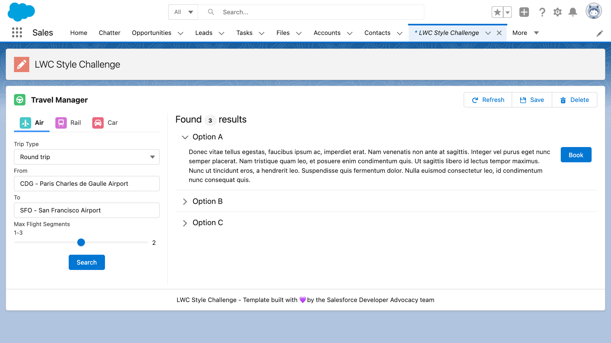
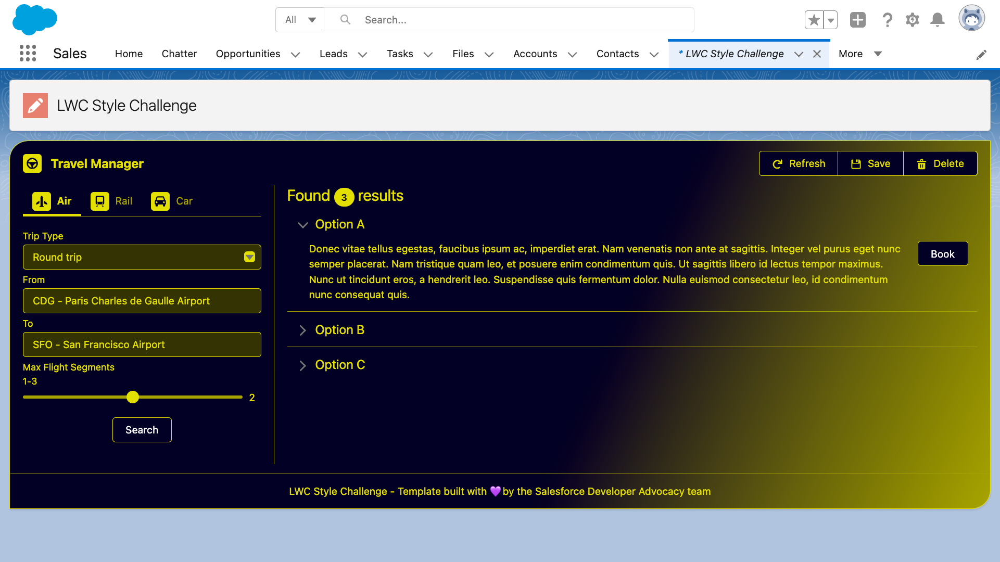

# LWC Style Challenge

Join us for a friendly **LWC Style Challenge**!

Tweet screenshots of your coolest style customization of this mock app with the **`#LWCStyleChallenge`** hashtag. We’ll review submissions and elect the best work.

There's only one simple rule: you may modify `styleChallengeHome.css`. No HTML or JS changes!

Impress us with your creative skills by showing how you can turn this app...



...into your personal stylish app:



## Install

Install the app by running this script:

**MacOS or Linux**

```
./install-dev.sh
```

**Windows**

```
install-dev.bat
```

## Resources

-   Styling Hook recipe in the [LWC Recipes](https://github.com/trailheadapps/lwc-recipes) sample app
-   Styling Hooks reference in the [Lightning Design System component blueprints](https://www.lightningdesignsystem.com/components/overview/)
-   Documentation for styling LWC in the [LWC Developer Guide](https://developer.salesforce.com/docs/component-library/documentation/en/lwc/lwc.create_components_css_intro)
-   Using CSS custom properties (variables) on [MDN](https://developer.mozilla.org/en-US/docs/Web/CSS/Using_CSS_custom_properties)
